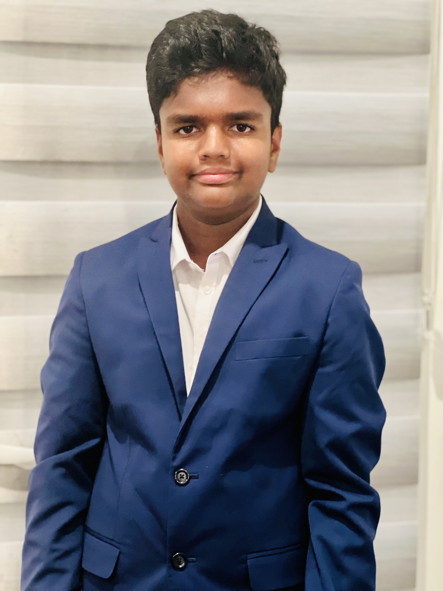

# Welcome to the world of Cognitive Coder

| [PASSIONS]()    | [PROJECTS]()    | [AWARDS]()    | [ARTICLES]()    | [VOLUNTEERING ACTIVITIES]() |

[Website](https://docs.github.com/en/pages/quickstart)

I am Srijon Mandal, a 9th Grader at Amador Valley High School. I am very much passionate about Mathematics and Bioengineering and always exploring how I can contribute to society. I enjoy Soccer Games. 

I love to develop software projects for social goods. I was rewarded by the Alameda County (1st position) and California State (3rd position) for my innovative work on Road Safety Device for Accident Prevention. 

I had the opportunity to build an Automated Item Delivery Robot for disadvantaged people and senior living. I also enjoy talking about topics like social justice, education for all, affordable healthcare, and financial equality in debate forums. My goal is to become an entrepreneur and work on humanitarian projects.

Here are some of my recent projects:
-------------

- RODAN:  https://youtu.be/3qjurglscrI, https://youtu.be/dT2ivetxkPM
- ARCAID: https://youtu.be/IlzKuGDdp6g
- Game Archive: https://github.com/srijon-mandal/game-archive/blob/master/README.md
- Global Warming Data Analysis: https://github.com/srijon-mandal/youngwonks-hackathon
- Identification of Diseases through Symptom Assesment: https://github.com/srijon-mandal/HealthHacks2021
